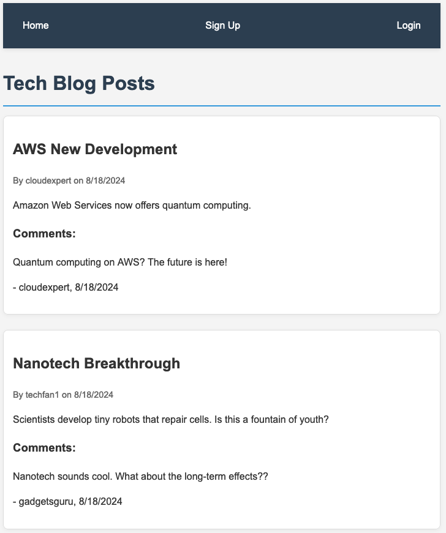
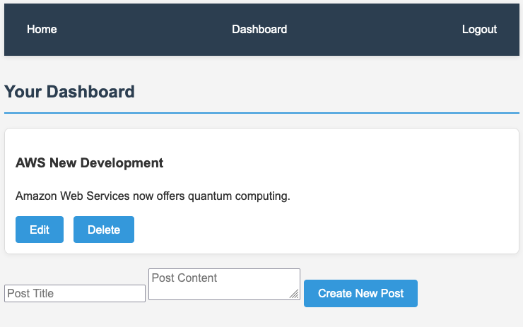
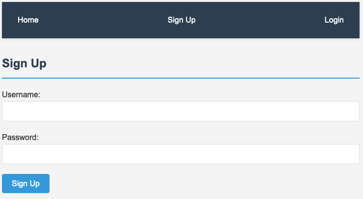
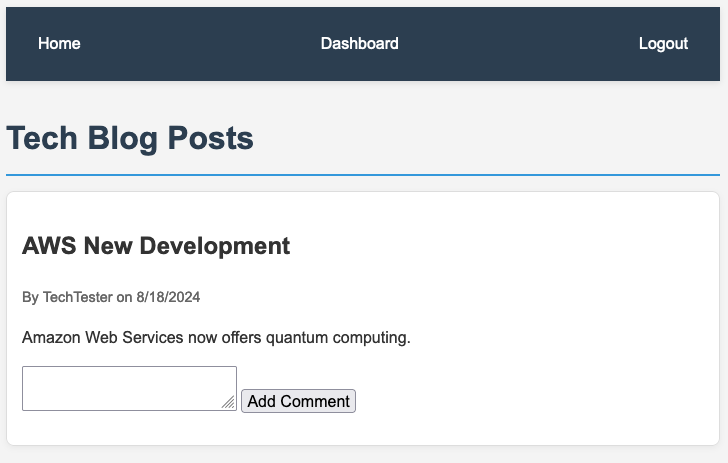

# C14-MVC-Tech-Blog

## Project Description

This project is a tech blog built using the MVC paradigm. It utilizes Sequelize to interact with a PostgreSQL database. The application provides API routes for categories, products, and tags, allowing for CRUD operations.

## Features

- User authentication (signup, login, logout)
- Create, read, update, and delete blog posts
- Comment on blog posts

## Usage

### Live Deployment
1. Open the application via this [Link to the application](https://c11-express-js-note-taker.onrender.com/).
2. Create an account or log in to an existing account.
3. Create, read, update, and delete blog posts.
4. Comment on blog posts.
5. Explore the application and enjoy!

### Local Development
1. Clone the repository
2. Install dependencies: `npm install`
3. Set up your PostgreSQL database by using the `schema.sql` and update `.env` file
4. Run seeds: `npm run seed`
5. Start the server: `npm start`
6. Visit `http://localhost:3001` in your browser

## Example(s)

[Demo Video]()

## Source Code

- Created by [Lixiviate](https://github.com/Lixiviate)
- Code Assistance:
  - [MDN Web Docs](https://developer.mozilla.org/en-US/)
  - [W3Schools](https://www.w3schools.com/)
  - [edX Xpert Learning Assistant](https://www.edx.org/)
  - [Handlebars.js](https://handlebarsjs.com/)

- Development Resources:
  - [bcrypt](https://www.npmjs.com/package/bcrypt)
  - [css](github.com/necolas/normalize.css)
  - [dotenv](https://www.npmjs.com/package/dotenv)
  - [Express.js](https://www.npmjs.com/package/express)
  - [Handlebars.js](https://www.npmjs.com/package/handlebars)
  - [node-postgres](https://www.npmjs.com/package/pg)
  - [PostgreSQL](https://www.postgresql.org/)
  - [Sequelize](https://www.npmjs.com/package/sequelize)

## License

This project is licensed under the MIT license.
